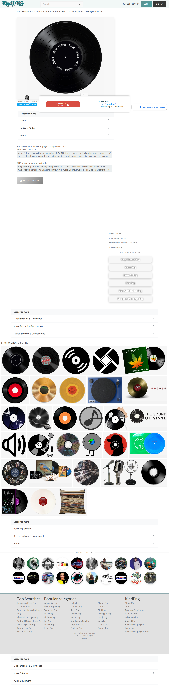

# Browser capture: https://www.kindpng.com/imgv/ihRmTiR_disc-record-retro-vinyl-audio-sound-music-retro/

- **Requested URL:** `https://www.kindpng.com/imgv/ihRmTiR_disc-record-retro-vinyl-audio-sound-music-retro/`
- **Final URL:** `https://www.kindpng.com/imgv/ihRmTiR_disc-record-retro-vinyl-audio-sound-music-retro/`
- **Time UTC:** `2026-05-14T08:41:44.743811+00:00`
- **Domain:** `kindpng.com`

## Screenshot

## Offline files

- [Offline HTML](./offline/index.html) ✅
- [MHTML snapshot](./offline/page.mhtml) ✅
- [Original final DOM before rewrite](./offline/final_dom_before_rewrite.html)
- [Offline asset report](./offline/assets.md)

## Page source and links

- [Final DOM](./source/final_dom.html)
- [Visible text](./source/visible_text.txt)
- [All DOM links](./source/all_links.txt)
- [Media/document links](./source/media_links.txt)

## Network / Ajax log

- [Network summary](./network/network.md) ✅
- [Full JSON](./network/network.json)
- [JSONL](./network/network.jsonl)
- Response bodies, when available, are saved in `network/bodies/`.

## Automation and session

- [Automation log](./automation-log.json) ✅
- Session state: `sessions/kindpng_com.json`

## Proxy

- Mode: `none`

## Stats

- Network requests: `139`
- Offline assets saved: `156`
- Offline assets skipped: `0`
- Offline assets failed: `14`
