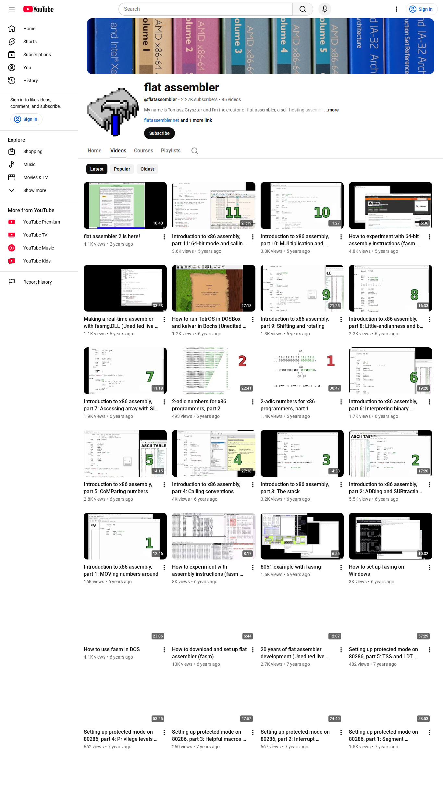

# Browser capture: https://www.youtube.com/channel/UCs_OWSjmFntZqjzSpgJoBhA/videos

- **Requested URL:** `https://www.youtube.com/channel/UCs_OWSjmFntZqjzSpgJoBhA/videos`
- **Final URL:** `https://www.youtube.com/channel/UCs_OWSjmFntZqjzSpgJoBhA/videos`
- **Time UTC:** `2026-05-13T11:27:12.444782+00:00`
- **Domain:** `youtube.com`

## Screenshot

## Offline files

- [Offline HTML](./offline/index.html) ✅
- [MHTML snapshot](./offline/page.mhtml) ✅
- [Original final DOM before rewrite](./offline/final_dom_before_rewrite.html)
- [Offline asset report](./offline/assets.md)

## Page source and links

- [Final DOM](./source/final_dom.html)
- [Visible text](./source/visible_text.txt)
- [All DOM links](./source/all_links.txt)
- [Media/document links](./source/media_links.txt)

## Network / Ajax log

- [Network summary](./network/network.md) ✅
- [Full JSON](./network/network.json)
- [JSONL](./network/network.jsonl)
- Response bodies, when available, are saved in `network/bodies/`.

## Automation and session

- [Automation log](./automation-log.json) ✅
- Session state: `sessions/youtube_com.json`

## Proxy

- Mode: `none`

## Stats

- Network requests: `156`
- Offline assets saved: `176`
- Offline assets skipped: `0`
- Offline assets failed: `0`
